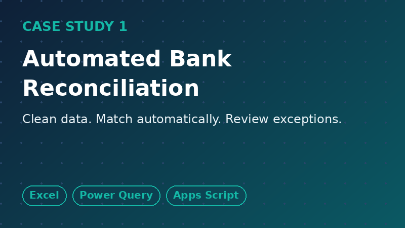
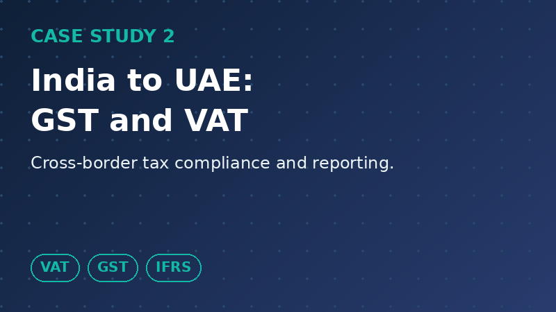
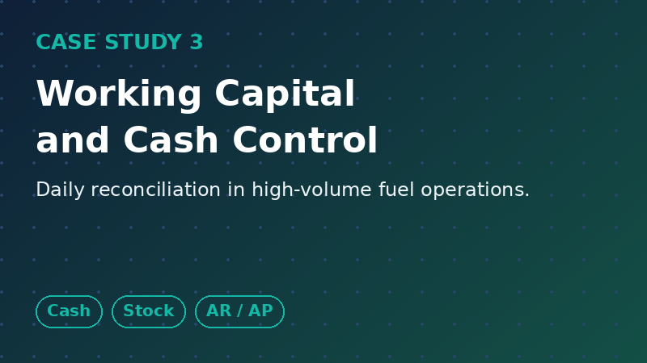

# Nisamudheen Aliparampil
### Accountant | UAE VAT & Tax Compliance | Finance Automation

Dubai / Sharjah, UAE · [LinkedIn](https://www.linkedin.com/in/nisamudheen-a-49556a298)

BCom (Accounting & Finance) · CMA USA candidate · Anti-Money Laundering certified

Languages: English · Malayalam · Hindi · Arabic
---

## What I do
- Full-cycle accounting: GL, AP/AR, bank reconciliation, month-end and year-end close
- UAE VAT and Indian GST compliance, audit support
- Financial statements (P&L, balance sheet) for management review
- Automating repetitive finance work with Excel, Power Query and Google Apps Script

**6+ years** across the UAE and India: corporate accounting, petroleum distribution and retail.

## Featured case studies

<table>
<tr>
<td width="33%"></td>
<td width="33%"></td>
<td width="33%"></td>
</tr>
</table>

## Code and tools
- [Excel matching formulas](code/excel-formulas/matching-formulas.md)
- [Power Query: clean bank CSV](code/power-query/clean-statement.m)
- [VBA: clean dates and flag duplicates](code/vba/CleanBankStatement.bas)
- [Apps Script: auto-match bank vs ledger](code/apps-script/reconcile.gs)
- [Synthetic sample data](sample-data/)
- [Explainer: GST vs UAE VAT](docs/gst-vs-uae-vat.md)

## Experience snapshot

| Period | Role | Focus |
|---|---|---|
| Oct 2025 to present | Accountant, OmnyPark (Sharjah) | Full-cycle bookkeeping, VAT, reconciliation automation |
| May 2023 to Sep 2025 | Sales Specialist, ADNOC Distribution (Dubai) | Sales tracking, shift and cash reconciliation, stock control |
| Feb 2020 to Mar 2023 | Accountant, Indian Oil Corp Ltd (Kerala) | Petroleum distribution accounting, GST, statutory audits |
| Jan 2019 to Feb 2020 | Accountant, Finite Accounts Solutions | Multi-client AP/AR, GL, payroll, returns |

## Confidentiality
All data in this repository is **synthetic**. Every tool was rebuilt independently for demonstration. No employer or client data is included.

## Contact

[LinkedIn](https://www.linkedin.com/in/nisamudheen-a-49556a298) · Email: nisamsha35@gmail.com
